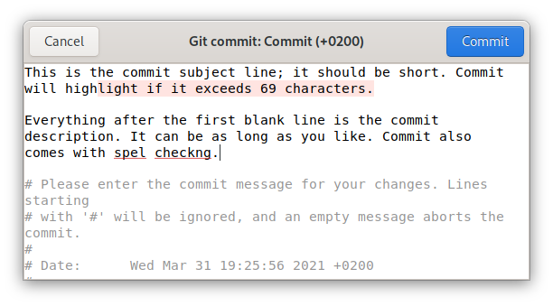

# Commit

Git commit message editor.

<!-- <a href='https://flathub.org/apps/details/re.sonny.Commit'></a> -->



## Features

  - Highlights overflow of subject line when it exceeds 69 characters.
  - Inserts empty line between subject line and rest of message.
  - Spell checking.
  - Select All selects only your commit message, not the Git commit comment.
  - Displays project folder and branch in window header.
  - Git Commit comment is not editable.
  - Dark theme support: the overflow highlight is adjusted according to your theme.
  - Supports git commit messages, merge messages, tag messages, git add -p messages, and rebase -i messages.

## Installation

```sh
cd Commit

flatpak-builder --user --force-clean --repo=repo --install-deps-from=flathub flatpak re.sonny.Commit.json
flatpak --user remote-add --no-gpg-verify --if-not-exists Commit repo
flatpak --user install --reinstall --assumeyes Commit re.sonny.Commit

git config --global core.editor "flatpak run re.sonny.Commit"
```

## Usage

Commit will pop up automatically when you make a commit in one of your projects.

To save your commit message, either press the Commit button or press _Ctrl+Return_.

To dismiss Commit and cancel your commit message, press _Escape_.

## Development

```
cd Commit
./run.sh tests/message-with-body
# Make changes
# Ctrl+Shift+R to restart
```

## Contributors

  * [Sonny Piers](https://github.com/sonnyp)
  * [Aral Balkan](https://ar.al)
  * [Sergey Bugaev](https://mastodon.technology/@bugaevc)

## Copyright

* Copyright © 2021 Sonny Piers
* Copyright © 2020 [Aral balkan](https://ar.al), [Small Technology Foundation](https://small-tech.org)

## License

GPLv3 or later. Please see [LICENSE](LICENSE) file.
