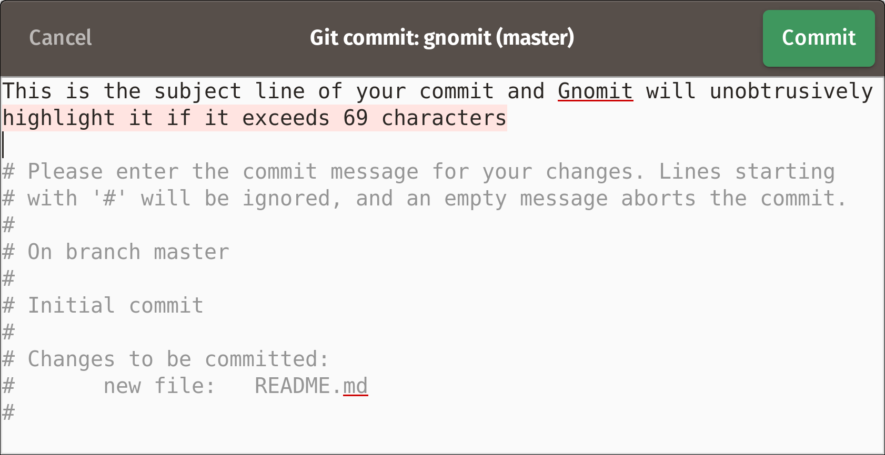

# Gnomit



Gnomit is a simple Git commit message editor for Gnome, inspired by the excellent [Komet app](https://github.com/zorgiepoo/Komet) for macOS.

Gnomit is written in [GJS](https://gitlab.gnome.org/GNOME/gjs/wikis/Home)[^1], uses [Flatpak](https://www.flatpak.org/), and is built with [Gnome Builder](https://wiki.gnome.org/Apps/Builder).

## Installation

You can install Gnomit [via Gnome Software](https://wiki.gnome.org/Apps/Software), [from Flathub](https://flathub.org/apps/details/ind.ie.Gnomit), or from my web site.

### Gnome Software

1. Launch Gnome Software and search for Gnomit.
2. Hit the _Install_ button.
3. Set Gnomit as your Git editor:

    ```bash
    git config --global core.editor "flatpak run ind.ie.Gnomit"
    ```


### Flathub

1. Go to the [Gnomit page on Flathub](https://flathub.org/apps/details/ind.ie.Gnomit)
2. Hit the _Install_ button.

    If your computer doesn’t automatically install Gnomit, in a terminal window go to the directory that the _ind.ie.Gnomit.flatpakref_ file was downloaded into (e.g., _~/Downloads_) and type:

    ```bash
    flatpak install ind.ie.Gnomit.flatpakref
    ```
3. Set Gnomit as your Git editor:

    ```bash
    git config --global core.editor "flatpak run ind.ie.Gnomit"
    ```

## Usage

Gnomit will pop up automatically when you make a commit in one of your projects.

To save your commit message, either press the Commit button or press _Ctrl+Return_.

To dismiss Gnomit and cancel your commit message, press _Escape_.

## Features

Feature-compatible (sans configuration options) with [the first release of Komet](https://github.com/zorgiepoo/Komet/releases/tag/0.1).

  * Highlights overflow of subject line when it exceeds 69 characters.
  * Inserts empty line between subject line and the rest of the message.
  * Has spell checking.
  * Select All selects only your commit message, not the Git commit comment.
  * Displays the project folder and branch in the window header.
  * The Git Commit comment is not editable.

## Known issues

### Slow start-up time

Compared to [directly running the GJS script](https://source.ind.ie/gnome/gnomit/gjs/tree/bare), the Flatpak version has a noticable delay before the Gnomit dialogue pops up.

Reportedly, the issue with slow start-up times [has been fixed](https://blogs.gnome.org/alexl/2018/01/16/fixing-flatpak-startup-times/) but we won’t be seeing the improvements until Linux distributions start pushing out version 2.13.0 of the _fontconfig_ package. My own Pop!_OS 18.04 distribution has it at 2.12.6. It remains to be seen what the performance will be like once that fix lands.

## Development notes

The following setting in _ind.ie.Gnomit.json_ allows the app to use mock data when run from Gnome Builder. If you want to test the behaviour of the app when it receives no command-line arguments from within Builder, remove this line.

```json
"x-run-args" : [
    "sandbox/gjs/tests/message-with-body"
],
```

## Deployment

To publish to Flathub (proper credentials required):

1. Remember to update Flatpak metadata, including release notes.
2. Update the version string in the main _meson.build_ file.
3. Tag the release in Git and push your tags.
4. Run the publish script:

    ```bash
    ./publish-to-flathub
    ```

    The script will create the Flathub build, run it so you can test it, and then prompt you if you want to deploy to Flathub.

    That’s it! Then wait for the changes to propagate on the Flathub web site.

## Contributors

  * [Aral balkan](https://ar.al)
  * [Sergey Bugaev](https://mastodon.technology/@bugaevc)

## Copyright

Copyright © 2018 [Aral balkan](https://ar.al), © 2018 [Ind.ie](https://ind.ie)

## License

GPLv3 or later. Please see [LICENSE](https://source.ind.ie/gnome/gnomit/blob/master/LICENSE) file.


[^1]: There is also a [Vala](https://wiki.gnome.org/Projects/Vala) [version](https://source.ind.ie/gnome/gnomit/vala) that I only just started working on and which is no way near being feature complete. I am using this project as a learning exercise as I begin to develop for Gnome after switching to [Pop!_OS 18.04](https://ar.al/2018/07/26/popos-18.04-the-state-of-the-art-in-linux-on-desktop/) on my main development machine.
