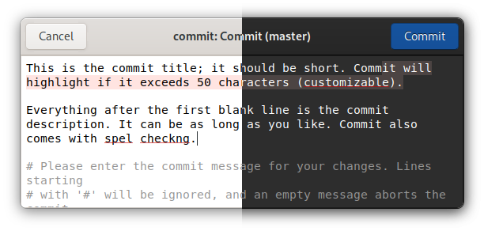

Git commit message editor

# Commit

Helps you write better Git commit messages.

<!-- <a href='https://flathub.org/apps/details/re.sonny.Commit'></a> -->



## Installation

Setup flatpak and flathub if you haven't https://flatpak.org/setup/

Then run

```sh
flatpak install re.sonny.Commit
git config --global core.editor "flatpak run re.sonny.Commit"
```

## Usage

Commit will pop up automatically when you make a commit in one of your projects.

To save your commit message, press the Commit button or the _Ctrl+Return_ key combination.

To abort and dismiss Commit, press the Cancel button or the _Escape_ key.

## Features

- Highlights overflow of subject line when it exceeds 69 characters
- Inserts empty line between subject line and rest of message
- Spell checking
- Select All selects only your commit message, not the Git commit comment
- Displays project folder and branch in window header
- Git Commit comment is not editable
- Dark theme support: the overflow highlight is adjusted according to your theme
- Supports git commit messages, merge messages, tag messages, add -p messages, and rebase -i messages
- Auto inserts blank line for commit description

## Development

```sh
cd Commit
npm install # Install development dependencies
./re.sonny.Commit tests/message-with-body
```

Make changes and hit `Ctrl+Shift+Q` on the Commit window to restart it.

## Building

<details>
  <summary>host</summary>

```sh
cd Commit
meson --prefix $PWD/install build
ninja -C build install
```

</details>

<details>
  <summary>Flatpak</summary>

Use [GNOME Builder](https://wiki.gnome.org/Apps/Builder) or

```sh
cd Commit
flatpak-builder --user --force-clean --repo=repo --install-deps-from=flathub flatpak re.sonny.Commit.json
flatpak --user remote-add --no-gpg-verify --if-not-exists Commit repo
flatpak --user install --reinstall --assumeyes Commit re.sonny.Commit
```

</details>

## Contributors

- [Aral Balkan](https://ar.al)
- [Sergey Bugaev](https://mastodon.technology/@bugaevc)
- [Sonny Piers](https://github.com/sonnyp)

## Copyright

- © 2020-2021 Sonny Piers
- © 2018-2020 [Aral balkan](https://ar.al), [Small Technology Foundation](https://small-tech.org)

## License

GPLv3 or later. Please see [COPYING](COPYING) file.
